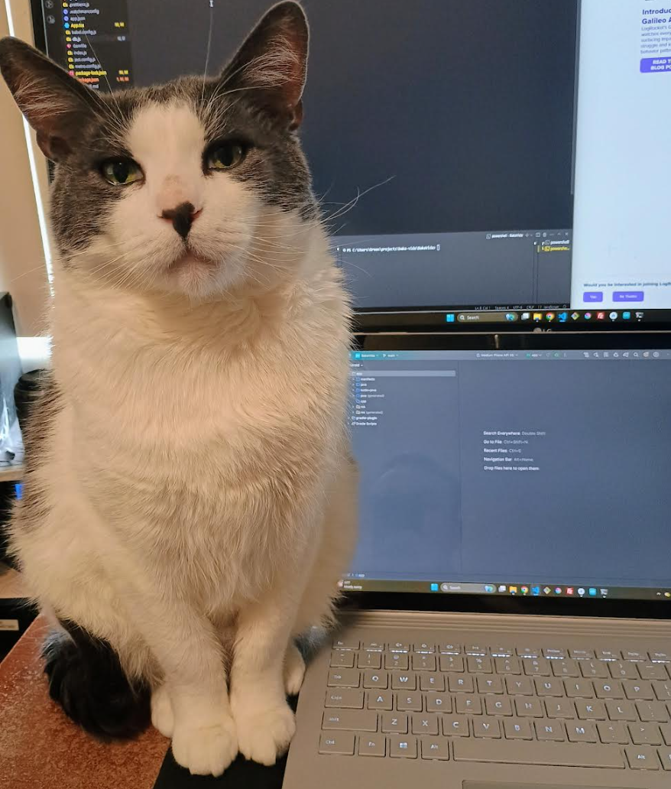

### 07/26/2025

7:41 PM

Ugh... I have this feeling of guilt for not driving Uber Eats right now.

I've been sick the last couple of weeks so I haven't donated plasma or driven Uber Eats, that's a loss of around $270 of extra money however it comes at a cost of 17.5 hrs of my life.

The problem is for a few of the days I'm just buying a 6-pack of some ale and bringing it home, gaming/drinking/watching TV instead of using the spare time.

So yeah like this weekend loss again, while I feel better I figured I'd work on this app finally.

I need to put msyelf on edge/be aware of the debt growth so I can spend a good amount of my time working to get out of it and spending less.

This week I've just been burning money buying food at work, alcohol and eating junk food like McDonalds

I at least have been working out consistently but I am overweight. I'm strong, I can easily bench 2x45s per side now eg. 12 reps fresh.

Okay so this is what I'll do:

- build basic navigation
  - includes: home, finance, diet, groceries, workout
- add in sqlite (already did this for another app)
- deploy to phone

I woke up at 3PM today/went to the gym already, mostly recovered from the small food coma (had a large Caramel Frapuccino, Spicy McChicken and Double Cheeseburger) makes me want to pass out.

7:58 PM
I struggle to work on this app because I don't really want to make it... I need it but I don't want to make it/don't feel joy.

8:15 PM
Stuck on this `Unable to resolve module nanoid/non-secure`

8:30 PM
REEEEEEEEEEEEEEEEEEEEEEEEEEEEEEEEEEEEEEEEEEE

One of those moments where Windows pisses me of "You cant delete node_modules, these aren't Joanna's node_modules"

Waiting for the configuring stuff to end/app opens again in emulator hopefully fixes the nanoid problem above

This keyboard is not very good on the Surface Book 3, it's mushy

OMG this is taking a while... watching the terminal say `EXECUTING [4m 36s]`

Goddddd LinkedIn is so cringe the stuff I see on there, ahh well. Gotta only go on there when looking for work.

WTH man... 8 minutes in still executing

Set it to best performance, power mode will see if that speeds it up

8:48 PM
OMG finally back to building

9:00 PM
Damn this progress is slow

9:29 PM
Ugh... idk why I don't want to do it

I'd be driving Uber Eats right now but I'm supposed to build this app

It would be faster to build a desktop app

Idk being on my phone makes it more gamifiable where I'm looking at it more even when I'm out and about

I want to push it to my phone real quick

9:39 PM

It says installing on device but it doesn't actually do it, ugh

9:49 PM
Ugh... still not installed

I could pull this repo down on my other device and try to install it there

10:35 PM

Ugh... while it did detect my phone/install it on there right away, there's a new problem

`cannot find symbol ViewManagerResolver viewManagerResolver`

Why...

10:55 PM

Alright forget it... I'll pick this up tomorrow, stick with the other device

---

### 07/12/2025

5:55 PM

Just got back from the gym. Damn I lost so much money this week from being sick. Lost $400/day gone, lost $100 from the plasma donations, lost $270 by not driving the whole weekend.

It's bad to think that way but yeah. I'm taking the weekend off to get some work done freelance and also for myself. I need to get sqlite working in RN for my project and client project. So I'll get this down today finally then integrate it into a project.

---

### 03/22/2025

I'm trying to work on this but I'm working two jobs.

Today I have like an hour before I go work out then drive Uber Eats for 8 hrs.

I have a high-paying main job but I have $83K of debt right now, trying to speed run it while times are good.

https://blog.logrocket.com/using-sqlite-react-native/

I was trying to avoid typescript in the past but now that I use it at work, I've gotten used to it.

12:31 PM
I'm struggling got this distraction lol

12:41 PM
Yeah I don't expect to get far, this is one of those projects I need to actually put a lot of time down into but never do.

I'm going to be working more so I want to actually use this app as a way to gamify my life it sounds sad I know but I hate being in debt, my life runs on the fear of not having a job/not being able to pay debt.

12:53 PM
Ehh... that's it for now, once I get this demo code in I'll rewrite it to what I need to use, my stuff like schedule, finances
